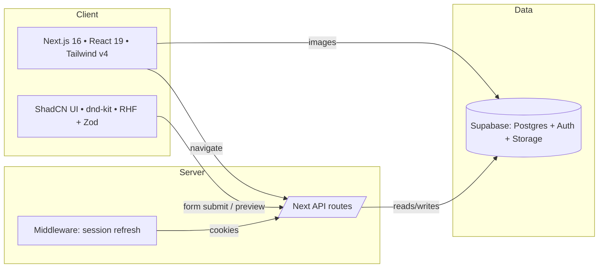
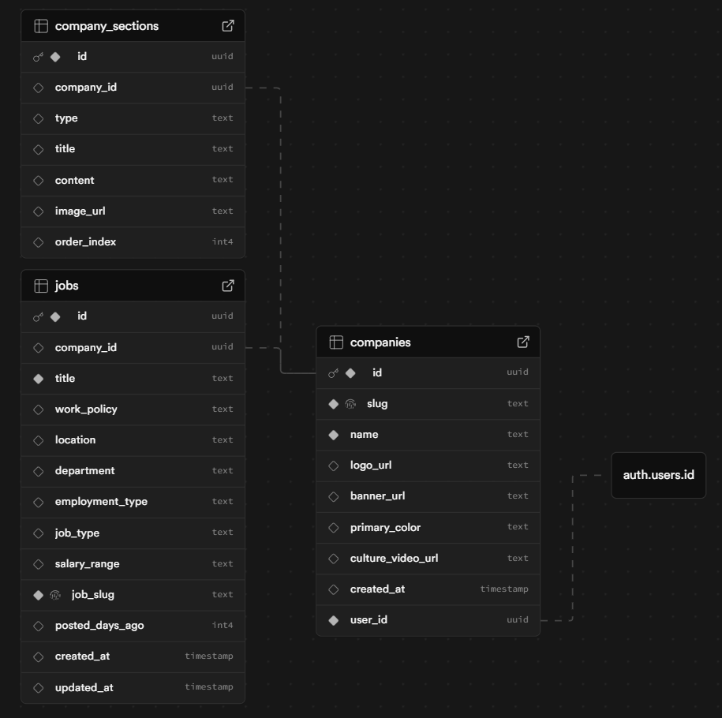

# Technical Specification

Version: 0.1.0 • Cross‑reference user guide in `README.md`.

## Architecture

- System diagram:



- Component interactions:
  - Edit page `src/app/[slug]/edit/page.tsx:1` sends preview updates to localStorage and an iframe.
  - Careers page `src/app/[slug]/careers/page.tsx:1` reads published data only from Supabase.
  - Job detail `src/app/[slug]/jobs/[jobSlug]/page.tsx:1` loads job by `job_slug` for a company.

## Frontend

- Frameworks:
  - Next.js `16.0.1` (`package.json:1`)
  - React `19.2.0` and React DOM `19.2.0` (`package.json:1`)
  - Tailwind CSS `^4` with PostCSS plugin (`postcss.config.mjs:1`)

- UI library:
  - ShadCN components: buttons, cards, tabs, dialog (`src/components/ui/*`)
  - Icons via `lucide-react`
  - Animations with `motion`

- State management:
  - React state and hooks
  - Forms: `react-hook-form` + `zod` validation (`src/app/[slug]/edit/page.tsx:1`)

## Backend

- Server specs:
  - Middleware refreshes Supabase sessions (`src/middleware.ts:1`).

- Database schema (Supabase/Postgres):
  - `companies`: `id`, `slug`, `name`, `logo_url`, `banner_url`, `primary_color`, `culture_video_url` (`src/types/index.ts:1`).
  - `company_sections`: `id`, `company_id`, `type`, `title`, `content`, `image_url`, `order_index` (`src/types/index.ts:11`).
  - `jobs`: `id`, `company_id`, `title`, `work_policy`, `location`, `department`, `employment_type`, `job_type`, `salary_range`, `job_slug`, `posted_days_ago`, `created_at` (`src/types/supabase.ts:1`).

- Data access:
  - Client: `@supabase/supabase-js` (`src/lib/supabase.ts:1`).
  - Server: service‑role client for privileged ops (`src/lib/supabase.ts:18`).
  - SSR helpers with `@supabase/ssr` (`src/lib/supabase/server.ts:1`, `src/lib/supabase/client.ts:1`).

- ORM configuration: None; direct Supabase client usage.

## API
- `GET /api/test-supabase` (`src/app/api/test-supabase/route.ts:1`)
  - Purpose: Validate server Supabase credentials by inserting a dummy `companies` row.
  - Response: `{ success: true, company: {...} }` or `500` on failure.
- This endpoint is used in `scripts/seed.ts:60` to verify Supabase credentials.
## Data

- Entity‑relationship diagram:


```mermaid
  companies {
    uuid id PK
    text slug UK
    text name
    text logo_url
    text banner_url
    text primary_color
    text culture_video_url
    uuid user_id FK → auth.users.id
    timestamptz created_at
  }

  company_sections {
    uuid id PK
    uuid company_id FK → companies.id
    text type  // allowed: about | culture | values | benefits | team
    text title
    text content
    text image_url
    int order_index
  }

  jobs {
    uuid id PK
    uuid company_id FK → companies.id
    text title
    text work_policy      // remote | hybrid | onsite
    text location
    text department
    text employment_type  // FT | PT | contract | internship
    text job_type
    text salary_range
    text job_slug UK
    int posted_days_ago
    timestamptz created_at
    timestamptz updated_at
  }
```

- Constraints:
  - `companies.slug` unique; used for routing.
  - `jobs.job_slug` unique; used for detail routing and upsert
  - `company_sections.order_index` controls display order per company.

- Migration strategy:
  - Use Supabase SQL editor to create tables and constraints.
  - Seed jobs with `scripts/seed.ts:60` reading `Sample Jobs Data.xlsx` and upserting by `job_slug`.
  - Perform chunked inserts to avoid conflicts (`scripts/seed.ts:118`).

## Security

- Authentication flow:
  - Client: Supabase Auth (`src/lib/supabase.ts:4`, `src/lib/auth.ts:4`).
  - Middleware refresh: `src/lib/supabase/middleware.ts:1` used by `src/middleware.ts:1`.
  - Server validation: `getServerSession` parses auth cookies and verifies user (`src/lib/auth-server.ts:1`).

- Data protection:
  - Recommend enabling Row Level Security (RLS) on all tables with policies restricting writes to authenticated recruiters for their company.
  - Service‑role key used only on server (`SUPABASE_SERVICE_ROLE_KEY`).

- Vulnerability prevention:
  - Validate inputs with Zod on forms.
  - Avoid exposing secrets in client; only publishable keys in browser.
  - Use `images.remotePatterns` to whitelist storage domains (`next.config.ts:1`).

## Scalability

- Load handling:
  - Next.js API routes scale horizontally on serverless platforms (e.g., Vercel).
  - Supabase scales with managed Postgres; use indexes on `slug`, `job_slug`, `company_id`.

- Horizontal scaling:
  - Stateless API routes; sessions via cookies.
  - Edge middleware supported for rapid auth refresh.

- Caching strategy:
  - CDN caching for public assets.
  - Consider ISR/Route Handlers caching for read‑only pages.
  - Client‑side memoization and debounced updates in edit flow (`src/app/[slug]/edit/page.tsx:219`).

## Performance

- Bottleneck analysis:
  - Multiple sequential Supabase queries per page; coalesce where possible.
  - Heavy client component tree in edit page; ensure memoization and minimal re‑renders.

- Optimization techniques:
  - Debounce form input updates (`use-debounce` in `src/app/[slug]/edit/page.tsx:46`).
  - Use `arrayMove` and `verticalListSortingStrategy` from dnd‑kit for efficient DOM updates.
  - Avoid unnecessary iframe reloads; use `postMessage` channel in preview.

- Monitoring setup:
  - Enable Vercel Analytics and Log Drains.
  - Supabase logs for DB performance and Auth events.

Cross‑references: See `README.md` for deployment, contribution, and environment setup. API and data sections here align with the Usage and Configuration guides there.